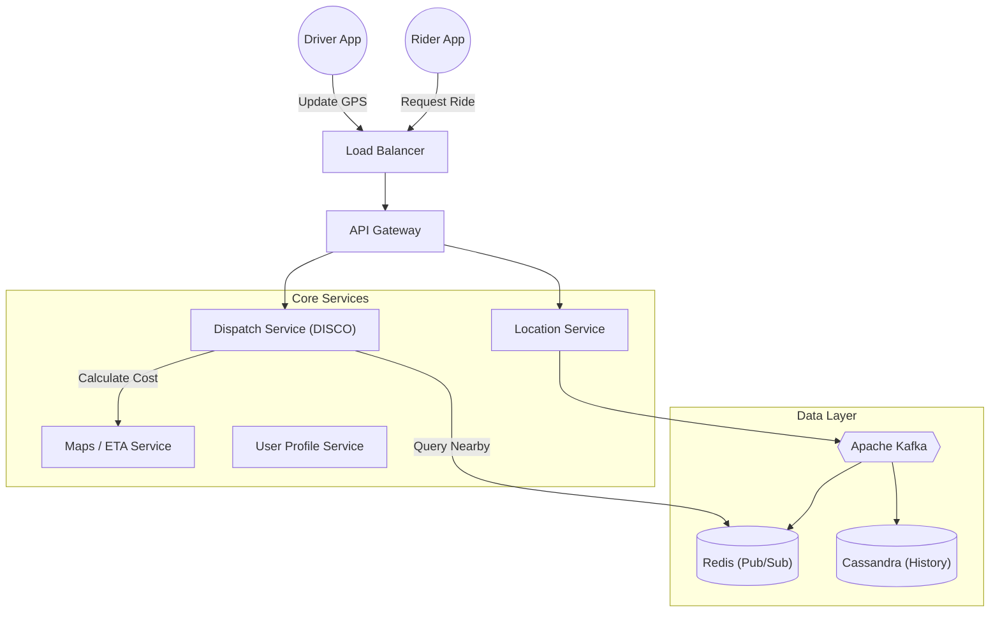
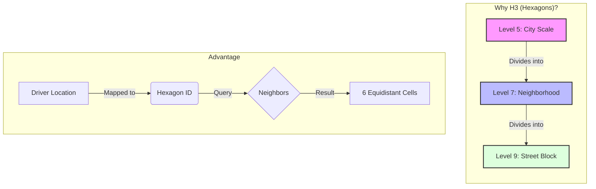
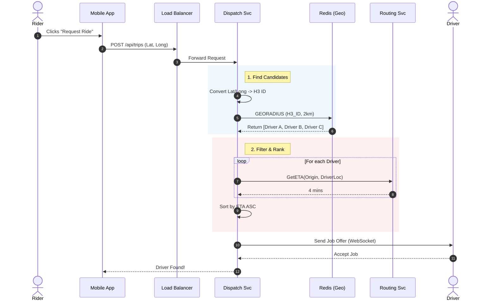
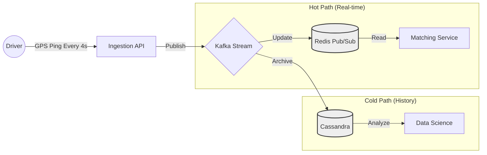

# 🚖 How Uber Finds Nearby Drivers: System Design Architecture

> A detailed architectural breakdown of Uber's real-time marketplace, focusing on high-throughput geospatial matching and low-latency dispatching.

## 📖 Table of Contents
- Executive Summary
- High-Level Architecture
- The Challenge: Geospatial Indexing
- The Dispatch Flow (Step-by-Step)
- Data Storage & Partitioning
- References

---

## Executive Summary

The core engineering challenge of Uber is **matching supply (drivers) with demand (riders) in real-time**. This requires a system capable of handling millions of GPS updates per second while maintaining sub-second latency for read queries.

**Key constraints:**
* **Real-time:** Updates must be reflected instantly.
* **Accuracy:** Drivers must be truly "nearby" (routing distance vs. physical distance).
* **Scalability:** Must handle massive spikes (e.g., New Year's Eve).

---

## High-Level Architecture

Uber operates on a microservices architecture. Below is the interaction between the Rider, Driver, and the Backend services.

---

## The Challenge: Geospatial Indexing

Standard SQL databases cannot handle "Find k-nearest neighbors" queries fast enough at Uber's scale. Uber solves this using **Geospatial Indexing**.

### The Solution: H3 (Hexagonal Hierarchical Spatial Index)

Uber partitions the world into hexagons. Why Hexagons?

| Feature | Squares (Google S2) ⬜ | Hexagons (Uber H3) 🛑 |
| :--- | :--- | :--- |
| **Neighbors** | 8 (Edges + Vertices) | **6 (Edges only)** |
| **Distance** | Center-to-neighbor distance varies | **Center-to-neighbor is equidistant** |
| **Distortion** | Higher distortion near poles | **Low distortion** |
| **Traversal** | Complex pathfinding | **Smooth approximations of circles** |

> **Implementation:** Every driver's GPS location is mapped to a unique H3 Hexagon ID. The system queries the driver's hexagon and the 6 immediate neighbors to find candidates.

---

## The Dispatch Flow (Step-by-Step)

How a ride request is processed:

---

## Data Storage & Partitioning

To handle the load, the data layer is split into "Hot" (Real-time) and "Cold" (Historical) storage.

### 1. Hot Storage (Redis)
* **Purpose:** Tracks current driver locations.
* **Data Structure:** `Key: DriverID | Value: {Lat, Long, Status, H3_ID}`
* **TTL (Time To Live):** Keys expire after short intervals to ensure data freshness.

### 2. Cold Storage (Cassandra)
* **Purpose:** Trip history, analytics, and audit logs.
* **Why Cassandra?** Optimized for massive write throughput (location pings every 4 seconds from millions of drivers).

### 3. Message Queue (Kafka)
* **Purpose:** Acts as a buffer between the high-volume driver API and the database. Ensures no location data is lost during traffic spikes.

---

## References

* System Design One Newsletter
* Uber Engineering: H3 Geo-Index
* Uber Engineering: Ringpop
