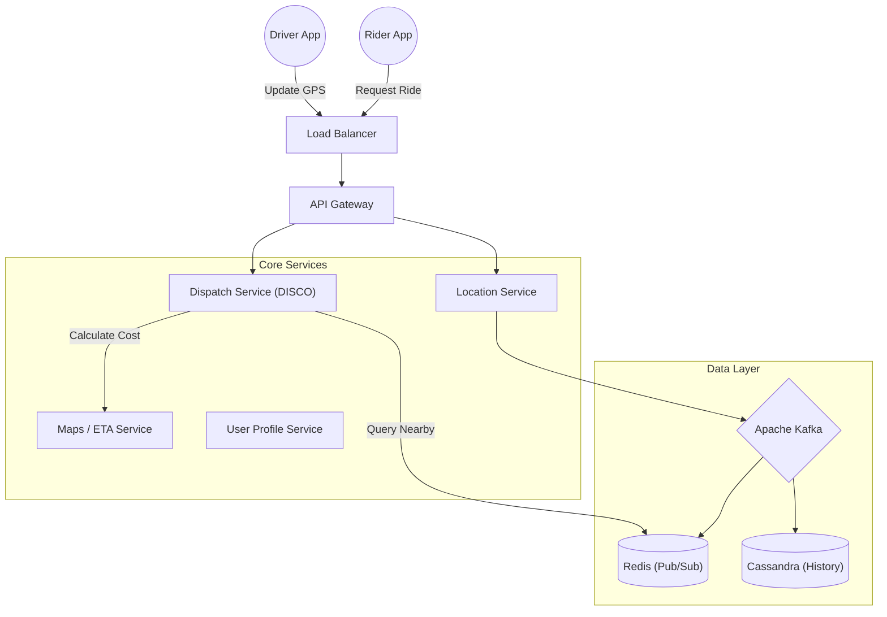
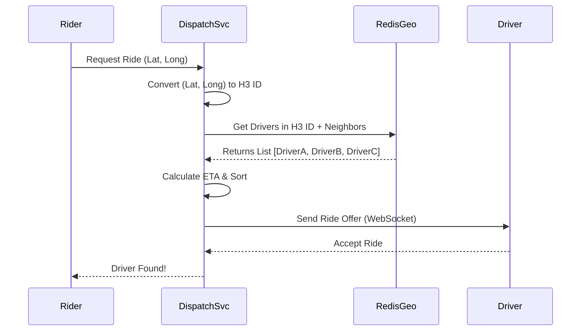

# 🚖 How Uber Finds Nearby Drivers: System Design Architecture

> A detailed architectural breakdown of Uber's real-time marketplace, focusing on high-throughput geospatial matching and low-latency dispatching.

## 📖 Table of Contents
- [Executive Summary](#executive-summary)
- [High-Level Architecture](#high-level-architecture)
- [The Challenge: Geospatial Indexing](#the-challenge-geospatial-indexing)
- [The Dispatch Flow (Step-by-Step)](#the-dispatch-flow-step-by-step)
- [Data Storage & Partitioning](#data-storage--partitioning)
- [References](#references)

---

## Executive Summary

The core engineering challenge of Uber is **matching supply (drivers) with demand (riders) in real-time**. This requires a system capable of handling millions of GPS updates per second while maintaining sub-second latency for read queries.

**Key constraints:**
* **Real-time:** Updates must be reflected instantly.
* **Accuracy:** Drivers must be truly "nearby" (routing distance vs. physical distance).
* **Scalability:** Must handle massive spikes (e.g., New Year's Eve).

---

## High-Level Architecture

Uber operates on a microservices architecture. Below is the interaction between the Rider, Driver, and the Backend services.

---

## The Challenge: Geospatial Indexing

Standard SQL databases cannot handle "Find k-nearest neighbors" queries fast enough at Uber's scale. Uber solves this using **Geospatial Indexing**.

### The Solution: H3 (Hexagonal Hierarchical Spatial Index)

Uber partitions the world into hexagons. Why Hexagons?

| Feature | Squares (Google S2) ⬜ | Hexagons (Uber H3) 🛑 |
| :--- | :--- | :--- |
| **Neighbors** | 8 (Edges + Vertices) | **6 (Edges only)** |
| **Distance** | Center-to-neighbor distance varies | **Center-to-neighbor is equidistant** |
| **Distortion** | Higher distortion near poles | **Low distortion** |
| **Traversal** | Complex pathfinding | **Smooth approximations of circles** |

> **Implementation:** Every driver's GPS location is mapped to a unique H3 Hexagon ID. The system queries the driver's hexagon and the 6 immediate neighbors to find candidates.

---

## The Dispatch Flow (Step-by-Step)

How a ride request is processed:

1.  **Request:** User requests a ride. The **Websocket Service** receives the request.
2.  **Hexagon Lookup:** The **Dispatch Service** identifies the user's H3 Hexagon ID.
3.  **Search:** It queries **Redis** for all drivers currently active in that Hexagon ID (and neighboring rings).
4.  **Filtering:** It filters out drivers who are already busy.
5.  **ETA Calculation:** The list of candidate drivers is sent to the **Routing Engine (Maps)** to calculate the actual ETA (road distance, not straight-line).
6.  **Offer:** The ride is offered to the driver with the lowest ETA.

---

## Data Storage & Partitioning

To handle the load, the data layer is split into "Hot" (Real-time) and "Cold" (Historical) storage.

### 1. Hot Storage (Redis)
* **Purpose:** Tracks current driver locations.
* **Data Structure:** `Key: DriverID | Value: {Lat, Long, Status, H3_ID}`
* **TTL (Time To Live):** Keys expire after short intervals to ensure data freshness.

### 2. Cold Storage (Cassandra)
* **Purpose:** Trip history, analytics, and audit logs.
* **Why Cassandra?** Optimized for massive write throughput (location pings every 4 seconds from millions of drivers).

### 3. Message Queue (Kafka)
* **Purpose:** Acts as a buffer between the high-volume driver API and the database. Ensures no location data is lost during traffic spikes.

---

## References

* [System Design One Newsletter](https://newsletter.systemdesign.one/p/how-does-uber-find-nearby-drivers)
* [Uber Engineering: H3 Geo-Index](https://eng.uber.com/h3/)
* [Uber Engineering: Ringpop](https://eng.uber.com/ringpop-open-source-node-js-library/)
